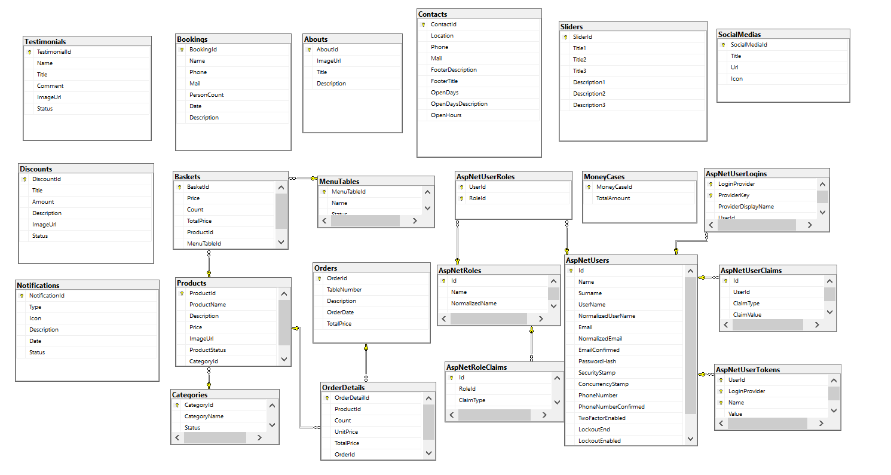

## 🚀 Proje Özeti: 
Bu projede, Asp.Net Core 6.0 kullanarak hem admin hem de vitrin panellerine sahip, kullanıcıların web arayüzü üzerinden sipariş verebildiği, rezervasyon yapabildiği ve anlık bildirimler alabildiği bir sistem geliştirdik. SignalR teknolojisi sayesinde anlık mesajlaşma, anlık bildirimler ve anlık sepet işlemleri başarılı bir şekilde entegre edildi.
## 📌 Başlıca Özellikler:
SignalR ile anlık bildirim, mesajlaşma ve sipariş yönetimi
Mail gönderimi ile rezervasyon onayı
Clean Code prensiplerine ve SOLID mimari standartlarına uygun kod yapısı
Backend API'sini UI tarafında consume ettik, güçlü bir arayüz oluşturduk.
## 💻 Kullandığımız Teknolojiler:
 *  ASP.NET Core 6.0: ASP .NET Core, web uygulaması geliştirmek için kullanılan bir frameworktür. Bu proje de geliştirilirken ASP.NET Core'un 6.0 sürümü kullanıldı.
 * Entity Framework Core: veritabanlarıyla etkileşim kurmak için kullanılan modern bir nesne-ilişkisel eşleme (ORM) aracıdır.
 * Real-Time Bildirim ve İstatistik Yönetimi: Projede  ve istatistiklerin anlık olarak görüntülenebilmesi ve gerçek zamanlı iletişim sağlanabilmesi için SignalR kütüphanesi kullanıldı. Bu sayede sayfa yenilenmeden, yapılan değişiklikler anlık olarak kullanıcı tarafından görüntülenebilmesi sağlandı.
 * SQL Server: Veri depolama, yönetim ve sorgulama sağlayan bir ilişkisel veritabanı yönetim sistemidir (RDBMS).
 * HTML, CSS, Bootstrap: Kullanıcı arayüzü tasarımında bu kütüphanelerden faydalanıldı.
 * JavaScript, Ajax: Web sayfalarına dinamik ve etkileşimli özellikler kazandıran, asenkron veri alışverişi için kullanıldı.
 * SMTP Mail Service: Yöneticiye siparişleri ve güncellemeleri göndermek için, bu e-posta entegrasyonu kullanıldı.
 * QR Code Generator: Siparişleri takip etmek için QR kod oluşturan bir kütüphane kullanıldı.
 * ASP.NET Identity: Projede güvenlik amaçlı kimlik doğrulama ve yetkilendirme sistemi kurmak için kullanıldı.
 * RapidAPI ve ApiConsume (API entegrasyonu için kullanıldı): Geliştiricilere farklı hizmet sağlayıcıların sunduğu API'leri tek bir platform üzerinden erişme ve yönetme imkanı sunan bir Api.
##  ▶️ Kurulum ve Çalıştırma
1. Depoyu bilgisayarınıza klonlayın.
2. SQL Server üzerinde bir veritabanı oluşturun.
3. appsettings.json dosyasında veritabanı bağlantı dizesini güncelleyin.
4. `dotnet ef database update` komutunu çalıştırarak veritabanı tablolarını oluşturun.
5. Projeyi çalıştırın ve web uygulamasını tarayıcınızda görüntüleyin.
## İlişkisel Veri Tabanı Diagramı

## Tetikleyiciler (Triggers)
 * Projede, sipariş detayları eklendiğinde veya silindiğinde Orders tablosundaki toplam fiyatı otomatik olarak güncellemek için iki tetikleyici (trigger) kullanılmıştır.
    
    ### Sipariş Detayları Eklendiğinde:
    Bu tetikleyici, sipariş detayları eklendiğinde toplam sipariş fiyatını otomatik olarak günceller.

        CREATE TRIGGER IncreaseOrderTotalPrice
        ON OrderDetails
        AFTER INSERT
        AS
        BEGIN
        DECLARE @OrderId int;
        DECLARE @OrderPriceTotal decimal(18, 2);

        -- inserted tablosunda birden fazla satır olabileceğini göz önünde bulundur.
        SELECT @OrderId = OrderId, @OrderPriceTotal = SUM(TotalPrice)
        FROM inserted
        GROUP BY OrderId;

         -- Toplam fiyatı güncelle
        UPDATE Orders
        SET TotalPrice = TotalPrice + @OrderPriceTotal
        WHERE OrderId = @OrderId;
        END;

   #### Sipariş Detayları Silindiğinde:
Bu tetikleyici, sipariş detayları silindiğinde toplam sipariş fiyatını otomatik olarak günceller.

    CREATE TRIGGER DecreaseOrderTotalPrice
    ON OrderDetails
    AFTER DELETE
    AS
    BEGIN
    DECLARE @OrderId int;
    DECLARE @OrderPriceTotal decimal(18, 2);
    -- deleted tablosunda birden fazla satır olabileceğini göz önünde bulundur.
    SELECT @OrderId = OrderId, @OrderPriceTotal = SUM(TotalPrice)
    FROM deleted
    GROUP BY OrderId;
    -- Toplam fiyatı güncelle
    UPDATE Orders
    SET TotalPrice = TotalPrice - @OrderPriceTotal
    WHERE OrderId = @OrderId;
    END;

## RapidAPI ve ApiConsume, API (Application Programming Interface) hizmetlerini kullanmayı kolaylaştıran araçlardır.

RapidAPI, farklı hizmet sağlayıcıların sunduğu API'leri tek bir yerden erişilebilir hale getiren bir platformdur. Bu platform, geliştiricilere geniş bir API koleksiyonuna erişme imkanı sağlar. RapidAPI üzerinden çeşitli kategorilerdeki API'lere erişebilir, bu API'lerin belgelerini ve kullanım kılavuzlarını inceleyebilir ve projelerinizde bu API'leri kullanabilirsiniz. RapidAPI'nin sunduğu avantajlardan biri, API'lere erişmek ve entegrasyonlarınızı yönetmek için tek bir arayüz sağlamasıdır. Böylece farklı API'ler için ayrı ayrı hesaplar oluşturmanıza gerek kalmaz.

## Api Sayfaları

 

## Ana sayfa

 
